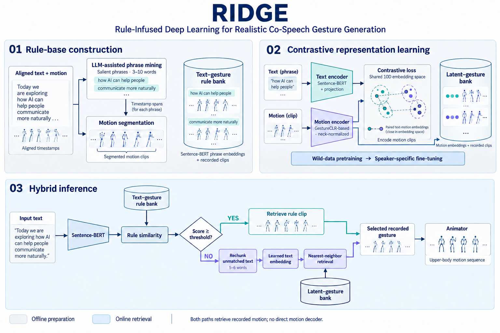
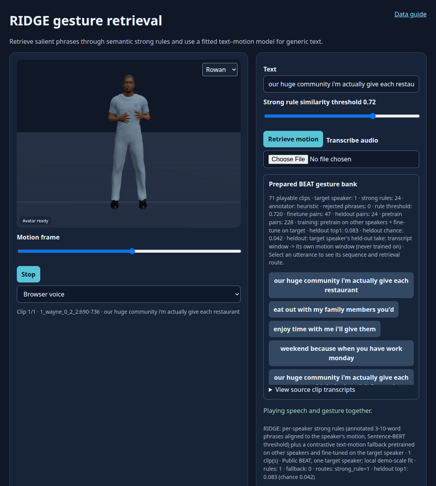

# RIDGE: Rule‐Infused Deep Learning for Realistic Co‐Speech Gesture Generation

**Ghazanfar Ali, Hwang Youn Kim, Jae‐In Hwang**

**Computer Animation and Virtual Worlds · 2025** · Published

[Paper / publisher](https://doi.org/10.1002/cav.70034) · [Project page](https://ghazanfarali.com/research/ridge/) · [BibTeX](citation.bib) · [Requirements](REQUIREMENTS.md) · [Code & setup](#implementation-and-usage)

> High-confidence rules and learned similarity retrieve semantically aligned gestures.



*Graphical abstract diagram. Confidence-gated rules and learned similarity retrieve recorded gesture clips.*

## Why this research

Gesture rules offer strong semantic matches when the right phrase is known, but leave gaps for unfamiliar language. RIDGE combines explicit rules with learned retrieval to improve coverage while retaining recorded motion.

RIDGE first searches a motion-derived rule base enriched with language-model assistance. When a rule does not meet the confidence threshold, a contrastively trained text–motion embedding retrieves an appropriate recorded gesture. Both paths use existing animation segments; direct decoding into new motion frames is described as future work.

## Method at a glance

**Text query** → **Rule match or learned fallback** → **Recorded gesture clip**

| | Research system |
|---|---|
| Input | Text |
| Method | Rule retrieval with confidence gating; contrastive text–motion retrieval fallback |
| Output | Retrieved recorded gesture clips |

## Evidence and scope

Gesture Cluster Affinity: RIDGE 0.73, rule baseline 0.60, end-to-end baseline 0.52, ground truth 0.90

**Attribution:** These findings describe the paper or manuscript, not results obtained with this repository's code.

**Study context:** BEAT co-speech motion and in-the-wild video data.

**Limitations:** Direct latent-to-motion decoding is outside the study. Retrieved motion inherits source quality, including finger artifacts.

## Explore the implementation

Phrase alignment, confidence-gated rules, trainable text/motion projections, recorded-clip fallback and reference-fitted GCA. The compact baseline freezes Sentence-BERT; this differs from the paper's end-to-end training.

This repository contains independently written research code. The institute's original source, datasets and trained models are not distributed. Public-data preparation, commands, assumptions and checks are documented below and in [REQUIREMENTS.md](REQUIREMENTS.md).

## Resources and citation

Read the paper through its [publisher record](https://doi.org/10.1002/cav.70034). PDFs are hosted by publishers or preprint archives rather than stored in this repository.

Please cite the research paper when using its ideas; [download the BibTeX citation](citation.bib). The implementation has its own documented scope.

<!-- demo-preview:start -->
## Demo preview



*The prepared BEAT sequence shows explicit strong-rule and locally fitted fallback routes. This preview is not a paper benchmark.*

From the repository root, using the Python environment described below:

```sh
python -m pip install -e .
python -m pip install -r scripts/requirements-demo.txt
python scripts/start_demo.py
```

Open **http://127.0.0.1:8080/**. First launch downloads one official BEAT BVH and matching TextGrid, prepares nine clips and disjoint paired windows in ignored `outputs/`, resolves three cached semantic annotations to strong rules, and fits a compact text-motion fallback locally. The fallback uses TF-IDF text features in place of Sentence-BERT for this small demo. Choose suggested utterances to compare strong-rule and trained fallback routes, then click **Play speech + gesture**. Stop cancels speech, and scrubbing previews a pose. The first launch also downloads pinned Three.js modules. Public recordings and fitted weights remain local.

The 3D presentation uses shared Three.js avatar components and bundled fictional CC0 characters. The paper-specific algorithms and data adapters live in this repository.


To replace the demo motion with an existing processed BEAT take, run `python scripts/prepare_beat_demo.py --processed /path/to/processed/beat`, then restart the server. Use `--rebuild --epochs 80` to regenerate the public sample and refit the small adapter. For a larger bank, the documented full-data CLI below retains the paper-specific input contracts.

<!-- demo-preview:end -->

## Implementation and usage

<!-- implementation-guide -->

Independent educational reimplementation of *RIDGE: Rule-Infused Deep Learning for Realistic Co-Speech Gesture Generation* (Ali, Kim, and Hwang, Computer Animation and Virtual Worlds 2025, DOI: [10.1002/cav.70034](https://doi.org/10.1002/cav.70034)). RIDGE retrieves recorded clips through a high-confidence phrase rule first and a contrastively learned text-motion space otherwise. It does not decode new animation frames and is not institute source code.

The default browser path is the prepared BEAT demo above. The older `python scripts/demo_server.py --example` path, when the prepared BEAT cache is absent, remains an offline fixture with author-created motion and illustrative vectors. The prepared-data commands below run the paper's pipeline:
1. LLM phrase extraction with the paper's prompt;
2. the rule base;
3. two-stage contrastive training;
4. hybrid retrieval.

The paper method's rule extraction is `ridge-gesture annotate` (below). The demo's three strong rules come from cached semantic annotations with explicit provenance. To regenerate them for the small demo bank with an OpenAI-compatible extractor, supply an endpoint and model, then rebuild the local index:

```sh
python scripts/beat_semantics.py --endpoint http://127.0.0.1:1234/v1 --model MODEL --output outputs/beat-library/strong-rules.json
python scripts/prepare_beat_demo.py --strong-rules outputs/beat-library/strong-rules.json
```

The extractor copies contiguous transcript spans and checks their alignment to bank clips. It does not infer gesture meaning from motion. The demo's cached annotations were generated with an assistant and remain reviewable in `scripts/beat-semantic-annotations.json`. The full paper method follows the rule-map and pose-matching lineage of [Automatic Text-to-Gesture](https://github.com/ghazanPK/automatic-text-to-gesture) and [Wild Pose Matching](https://github.com/ghazanPK/wild-pose-matching), but this repository runs independently.

```bash
python -m pip install -e .
python scripts/prepare_viewer.py --out static/vendor
python scripts/demo_server.py --example
```

### Reproduce with BEAT

`scripts/prepare_paper_method.py` runs this repository's full per-speaker pipeline on public [BEAT](https://pantomatrix.github.io/BEAT/) motion, then serves the result in the browser viewer. One speaker is the target (`--target-speaker`, default the first selected speaker); the other selected speakers pretrain:

| Data | Default | Used for |
|---|---|---|
| Target speaker, training takes | Speaker 1, first two takes | Timed transcripts → gesture phrases (`ridge-gesture annotate`) → Sentence-BERT strong rules over the speaker's own motion spans (`ridge-gesture build-rules`). The same takes give 3 s text–motion pairs for fine-tuning. |
| Other speakers | Speakers 2–4, three takes each | 3 s text–motion pairs for stage-1 pretraining (`ridge-gesture train --preset pretrain`). Stage 2 fine-tunes on the target pairs (`--preset finetune --init`). `--no-pretrain` trains on the target only. |
| Target speaker, held-out take | Last selected take | Transcripts never used for rules or training. They probe the learned fallback. |

**Annotation.** By default `annotate` uses its offline content-word heuristic (`--phrases-per-record`, default 12). Two flags switch it:
- `--external-annotations reviewed.json` supplies reviewed phrases.
- `--llm-endpoint http://127.0.0.1:1234/v1 --model MODEL`, or `--llm-command "ollama run llama3.1"`, sends the paper's verbatim extraction prompt. With raw BEAT, the original TextGrid is the prompt content.

**1. Sentence-BERT, once.** The hook never downloads a model. Save `all-MiniLM-L6-v2` locally (about 90 MB):

```bash
python -c "from sentence_transformers import SentenceTransformer; SentenceTransformer('all-MiniLM-L6-v2').save('models/all-MiniLM-L6-v2')"
```

`--sbert DIR` or the `SBERT_MODEL` environment variable selects another local copy.

**2a. Processed OmniMo collection.** The collection is laid out as `<root>/<speaker>/{meta.json,motion.npz}`:

```bash
python scripts/prepare_paper_method.py --processed /path/to/processed/beat
python scripts/demo_server.py --prepared outputs/paper-method/<key> --port 8080
```

The last line of standard output is JSON whose `server_args` give the exact prepared folder.

**2b. Raw BEAT from Hugging Face.** Download BVH and TextGrid pairs from the official dataset [`H-Liu1997/BEAT`](https://huggingface.co/datasets/H-Liu1997/BEAT) into `data/beat/beat_english_v0.2.1/<speaker>/`. Each BVH is about 20 MB:

```bash
base=https://huggingface.co/datasets/H-Liu1997/BEAT/resolve/main/beat_english_v0.2.1/beat_english_v0.2.1
for take in 1_wayne_0_1_1 1_wayne_0_2_2 1_wayne_0_3_3 2_scott_0_1_1 2_scott_0_2_2 3_solomon_0_3_3 3_solomon_0_4_4 \
            4_lawrence_0_2_2 4_lawrence_0_3_3; do
  spk=${take%%_*}; mkdir -p data/beat/beat_english_v0.2.1/$spk
  for ext in bvh TextGrid; do curl -fL -o data/beat/beat_english_v0.2.1/$spk/$take.$ext $base/$spk/$take.$ext; done
done
python scripts/prepare_paper_method.py --beat-root data/beat/beat_english_v0.2.1
```

**Launcher.** `python scripts/start_demo.py` runs this hook after the shared BEAT demo preparation.
- **Source.** It looks in `--processed` or `--beat-root`, then `BEAT_PROCESSED_ROOT` or `BEAT_RAW_ROOT`, then `data/beat/processed` or `data/beat/beat_english_v0.2.1`.
- **Missing input.** Without a source or Sentence-BERT, it prints the next step and the default demo starts unchanged.
- **Cache.** Results are cached in ignored `outputs/paper-method/<settings hash>/`. A repeat launch with the same settings returns at once; `--force` rebuilds.

**Demo scale and paper preset.**
- **Demo (default).** Speakers 1–4, up to three takes each, at most 150 epochs per stage with the CLI's early stopping. On a CPU it takes under a minute. One local run on the processed collection gave these results:
  - 24 heuristic strong rules for speaker 1;
  - 228 pretraining pairs and 47 fine-tuning pairs;
  - a held-out top-1 of 0.083 against a chance of 0.042, over 24 held-out windows. The metric asks whether a held-out transcript window retrieves its own motion window.
- **Paper preset.** `--preset paper` uses the CLI presets: 300 epochs, early stopping, pretraining batch 1000 and fine-tuning batch 64. Combine it with `--speakers all --max-takes-per-speaker 0` and an LLM annotator for a paper-scale run. `--gesture-init` starts the motion branch from a GestureCLR checkpoint.

**Viewer.** `/api/beat-library` lists the strong rules, the fallback windows, suggested queries and held-out probes, together with the metrics. The suggested queries are rule phrases plus a rule-and-probe mix. `/api/beat-query` runs `hybrid_retrieve`. Spans above the threshold slider (default 0.72) play the speaker's annotated motion with route `strong_rule`. The remaining words take `trained_text_motion_fallback`, or `idle_no_match` when an optional `min_similarity` floor is set.

**Limits.** The heuristic phrases are not the paper's LLM annotation, and Sentence-BERT stays frozen. A demo-scale fallback trained on about fifty target windows retrieves only slightly better than chance and often repeats a window; larger selections help little without the paper's 300-hour pretraining corpus.

### Setup and public data

```bash
python -m venv .venv
source .venv/bin/activate
python -m pip install -e . pytest
```

On Windows PowerShell, activate with `.\.venv\Scripts\Activate.ps1` instead of the `source` line.

Run a CPU verification workflow with procedurally generated inputs:

```bash
python scripts/verify.py
```

It generates transcripts, reviewed annotations, 384-D paired embeddings, motion, and a local SentenceTransformer fixture. It then invokes the installed CLI paths:
- `annotate`, with reviewed JSON and with a local stand-in LLM command;
- `build-rules`;
- `train`, as pretraining with `--gesture-init`, then fine-tuning with `--init`;
- `retrieve`;
- `eval-gca`.

Both rule and neural fallback retrieval are exercised, with results under `outputs/verification/`. The local encoder replaces only downloadable Sentence-BERT weights; real `all-MiniLM-L6-v2` embeddings use the same checkpoint and index path.

Request [BEAT](https://pantomatrix.github.io/BEAT/) from its maintainers and prepare its text, timestamps, and upper-body motion under its license. Public videos may augment pretraining only when you have permission to process them. No BEAT recordings, wild videos, original performer annotations, trained weights or reported scores are bundled. The demo includes three cached semantic phrase annotations from the public transcript, with their provenance recorded.

**Data contracts**
- Transcript JSONL rows contain `record_id`, `speaker`, `text` and `words: [{word,start_frame,end_frame}]`. They may also contain `textgrid`, the source file sent to the LLM.
- Gesture IDs are `record_id:start-end`. Motion is looked up from `motion_records.npz`, keyed by `record_id`.
- Contrastive `pairs.npz` contains:
  - normalized `text_embeddings[N,384]`;
  - neck-centered `motion[N,F,D]`;
  - string `ids[N]`;
  - optional `texts`, `speakers`, `lengths` and `sbert` (the encoder that produced the embeddings).
- Rules and checkpoints record their Sentence-BERT, and `retrieve` reuses it. Changing the encoder means rebuilding every index.

```bash
# Paper rule extraction: the verbatim prompt over each TextGrid, to an OpenAI-compatible endpoint or a local CLI
ridge-gesture annotate --transcripts data/prepared/transcripts.jsonl --llm-endpoint http://127.0.0.1:1234/v1 --model MODEL --output outputs/phrases.jsonl
ridge-gesture annotate --textgrid data/beat/1/*.TextGrid --records-output data/records.jsonl --llm-command "ollama run llama3.1" --output outputs/phrases.jsonl
# Alternatives: reviewed JSON {record_id: [phrases]} or the content-word heuristic (no flags)
ridge-gesture annotate --transcripts data/prepared/transcripts.jsonl --external-annotations data/reviewed.json --output outputs/phrases.jsonl
ridge-gesture build-rules --records data/prepared/transcripts.jsonl --annotations outputs/phrases.jsonl --per-speaker --output outputs/rules
# Stage 1: large (e.g. 2D-to-3D mapped video) corpus; stage 2: BEAT fine-tuning
ridge-gesture train --pairs data/pretrain/*.npz --preset pretrain --gesture-init checkpoints/gestureclr.pt --output checkpoints/ridge-pretrain.pt
ridge-gesture train --pairs data/prepared/train_pairs.npz --preset finetune --init checkpoints/ridge-pretrain.pt --per-speaker --output checkpoints/speakers
ridge-gesture retrieve --rules outputs/rules/1_wayne.rules.jsonl --checkpoint checkpoints/speakers/1_wayne.pt --threshold 0.72 --text "Explain the next important action" --output outputs/sequence.json
ridge-gesture eval-gca --reference data/gca_reference.npz --candidate data/gca_heldout_predictions.npz
python -m pytest
```

**Annotation**
- `annotate` sends the paper's extraction prompt verbatim, followed by a one-line JSON output instruction and the TextGrid content. When a record has no TextGrid file, the content is rendered from its timed words.
- Proposed phrases must have 3–10 words and appear contiguously in the transcript. When a phrase is repeated, each repeat is bound to the next occurrence.
- Each output row records provenance: the prompt hash, model, endpoint or command, the raw reply, and rejected proposals with reasons.
- An API key, when needed, is read from the variable named by `--api-key-env`.

**Retrieval** scores every 3–10-word span at every start position against the rule base. It accepts the best-scoring spans above the threshold, so filler is not absorbed. Words between rules go to the learned fallback in chunks of at most six words. The threshold is a validation parameter, not a paper-fixed universal value. Output labels every segment `rule` or `fallback`, with its word span.

**Training** uses in-batch contrastive loss with a configurable temperature `--tau`.
- The motion branch has the GestureCLR architecture. `--gesture-init` loads its weights from a GestureCLR checkpoint: `{"state": GestureCLR.state_dict(), "d3": D}` from the multilingual or wild-pose `train` commands (`motion3d.*` keys), `{"motion_encoder": state}`, or a bare encoder state dict.
- `--preset pretrain` uses batch 1000; `--preset finetune` uses batch 64. Both use a validation split, early stopping (`--patience`, `--min-delta`) and an LR schedule (`--schedule plateau|cosine|none`). Epoch caps and learning rates are implementation choices.
- `--init` continues from a stage-1 checkpoint.
- `--finetune-text` also trains Sentence-BERT, end to end as in the paper, when pairs include `texts`.
- `--speaker` or `--per-speaker` trains per-speaker models.

GCA reference and candidate files both contain `text_embeddings` and `motion_embeddings`. Embeddings are L2-normalised before clustering, so the clusters match the cosine scoring. The reference file must contain training/reference speakers only. The candidate file contains held-out predictions; it never participates in fitting text clusters or gesture subclusters.

### Prepare data and compare retrieval branches in the browser

`scripts/prepare_public_data.py` converts licensed BVH takes to 15 FPS neck-centered XYZ motion, phrase records and Sentence-BERT text embeddings. Transcripts can be timestamped JSONL or BEAT TextGrids.
- Pass several `--bvh`/`--transcript` pairs, or a `--manifest` JSON list of `{bvh, transcript, speaker, record_id}`.
- Record IDs default to the take name. Speakers are parsed from BEAT names (`1_wayne_0_1_1` → `1_wayne`) unless `--speaker` is given.
- Windows without speech are skipped.
- `--sbert` names the encoder. `all-MiniLM-L6-v2` (the default) is downloaded by sentence-transformers on first use; pass a local directory to work offline.
- Use at least six seconds per take and the script's upper-body joint names. JSONL accepts one word per line or one record containing `words`; timestamps can use seconds or frame indices.

```bash
python scripts/prepare_public_data.py --bvh data/beat/1/1_wayne_0_1_1.bvh data/beat/1/1_wayne_0_2_2.bvh --transcript data/beat/1/1_wayne_0_1_1.TextGrid data/beat/1/1_wayne_0_2_2.TextGrid --sbert models/all-MiniLM-L6-v2 --output-dir data/prepared
ridge-gesture annotate --transcripts data/prepared/transcripts.jsonl --llm-endpoint http://127.0.0.1:1234/v1 --model MODEL --output outputs/phrases.jsonl
ridge-gesture build-rules --records data/prepared/transcripts.jsonl --annotations outputs/phrases.jsonl --sbert models/all-MiniLM-L6-v2 --output outputs/rules.jsonl
ridge-gesture train --pairs data/prepared/train_pairs.npz --preset finetune --output checkpoints/ridge.pt
python scripts/prepare_viewer.py --out static/vendor
python scripts/demo_server.py --data-dir data/prepared --rules outputs/rules.jsonl --checkpoint checkpoints/ridge.pt
```

The threshold slider changes the rule gate live. The trace labels each selected clip as `rule` or `fallback`, shows similarity and plays its actual motion frames. Prepared mode imports this repository's `src/` package, not the vendored stand-in copy. Use speaker-separated reference and candidate files with `ridge-gesture eval-gca` for the GCA diagnostic; the local demo does not assert the paper's reported score. By default Sentence-BERT stays frozen and only the projection and motion encoder train; `--finetune-text` trains it too. `scripts/verify.py` uses random arrays plus a local illustrative text encoder solely to exercise interfaces.

[Automatic text-to-gesture](https://github.com/ghazanPK/automatic-text-to-gesture) is the rule-mining precursor; [wild pose matching](https://github.com/ghazanPK/wild-pose-matching) and [multilingual gesture synthesis](https://github.com/ghazanPK/multilingual-gesture) develop the GestureCLR lineage. These are research references, not package dependencies.

### Limits and licenses

Sentence-BERT is frozen unless `--finetune-text` is given; the paper trains both encoders end to end. The 2D-to-3D mapping that produced the paper's 300-hour pretraining corpus is not included: stage 1 takes whatever pairs you supply. Heuristic phrases are not equivalent to expert or LLM annotation, and LLM output depends on the model you choose. GCA measures affinity to a fitted cluster structure and still needs perceptual validation. Source motion quality, including finger artifacts, carries into retrieved clips. Code is MIT licensed; BEAT, pretrained encoders, videos, and annotations keep separate terms.

### Citation

Machine-readable metadata is in [citation.bib](citation.bib).

```bibtex
@article{ali2025ridge, title={RIDGE: Rule-Infused Deep Learning for Realistic Co-Speech Gesture Generation}, author={Ali, Ghazanfar and Kim, HwangYoun and Hwang, Jae-In}, journal={Computer Animation and Virtual Worlds}, volume={36}, number={4}, pages={e70034}, year={2025}, doi={10.1002/cav.70034}}
```

### Optional local speech adapters

The viewer can speak its query or transcribe user-selected audio. Browser voice and typed text work without model weights. Install `python -m pip install -e ".[speech]"` for local adapters. Obtain Kokoro files from [Kokoro-82M](https://huggingface.co/hexgrad/Kokoro-82M) yourself: `config.json`, `kokoro-v1_0.pth` and `voices/af_heart.pt`. Set `KOKORO_MODEL_DIR` to their parent folder before launching the server. Follow [Kokoro's English phonemizer setup](https://github.com/hexgrad/kokoro), including espeak-ng where required, then choose Local Kokoro. For ASR, set `WHISPER_MODEL_DIR` to a user-downloaded [faster-whisper](https://github.com/SYSTRAN/faster-whisper) small model directory containing `model.bin` and its tokenizer/configuration files. ASR runs on CPU with INT8, requests word timestamps and VAD, and disables implicit model downloads. No speech model files or audio recordings are included in this repo.

<!-- avatar-recorded-motion:start -->
## Bundled characters and recorded public motion

The browser demos include Rowan and Mira, two new fictional GLB characters built with MPFB and MakeHuman community assets under CC0 1.0. See [avatar licensing and provenance](static/avatars/LICENSE.md). Use the character selector in the stage. The shared renderer supports body bones, ARKit facial channels, and approximate speaking motion.

Recorded motion is adapted to the characters' proportions. Palm landmarks set hand orientation; finger curl uses bounded hinge bends and preserves the character's finger spacing. Thumb-base opposition stays in the authored pose, with conservative recorded curl at the remaining joints. Distal bends are estimated from the preceding joint when fingertip landmarks are absent. Use the companion's hand close-up views to inspect the result.

The [avatar motion companion](static/recorded-motion.html) opens at `/recorded-motion.html` while the demo server is running. A small authored motion and face sample loads automatically; click **Play** without uploading files. It also plays locally selected BEAT motion, face, and WAV files on the bundled characters. These are presentation and data-inspection tools, separate from the paper implementation. No BEAT recording, dataset archive, or trained model is bundled. For recorded public motion, install the one preparation dependency and fetch a small official sample into ignored `outputs/beat-demo/`:

```sh
python -m pip install numpy
python scripts/beat_demo/fetch_modalities.py --speaker 1 --sequence 1_wayne_0_1_1 --include-bvh --max-bytes 25000000 --output-dir outputs/beat-demo/source
python scripts/beat_demo/prepare_bvh.py --bvh outputs/beat-demo/source/1_wayne_0_1_1.bvh --output outputs/beat-demo/sample/1_wayne_0_1_1-raw-motion.json --frames 120
python scripts/beat_demo/prepare_modalities.py --sequence 1_wayne_0_1_1 --source outputs/beat-demo/source --output outputs/beat-demo/sample --frames 120
```

Open the companion and select `outputs/beat-demo/sample/1_wayne_0_1_1-raw-motion.json`, `1_wayne_0_1_1-face.json`, and `1_wayne_0_1_1.wav`. The downloader caps each original file at 25 MB; the prepared clip contains up to 120 frames. The viewer uses local files and does not upload them. For other BEAT takes, substitute a matching official speaker and sequence ID.

If you already have OmniMo's processed 52-joint Unity humanoid data, use that normalized motion instead:

```sh
python scripts/beat_demo/prepare.py --dataset /path/to/processed/beat --speaker 1 --take 1_wayne_0_1_1 --output outputs/beat-demo/sample/1_wayne_0_1_1-motion.json --max-frames 120
```

Select the resulting `*-motion.json` in the companion. Its metadata carries the humanoid joint mapping and source-to-avatar coordinate conversion. The viewer fits source FK directions from the avatar's bind pose, following the spine explicitly at branching joints. This avoids applying incompatible source bone twist to the MPFB skin; it does not reproduce exact performer twist. The adapter supports Unity proximal/intermediate/distal finger names. Raw BVH remains a public-data alternative; do not mix the two skeleton conventions.
<!-- avatar-recorded-motion:end -->
